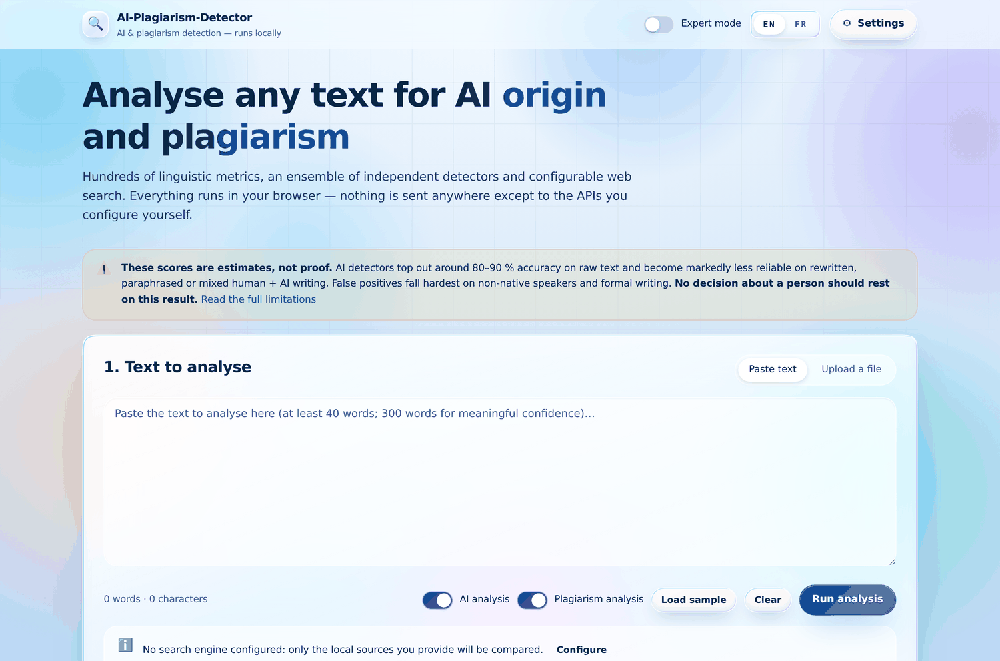
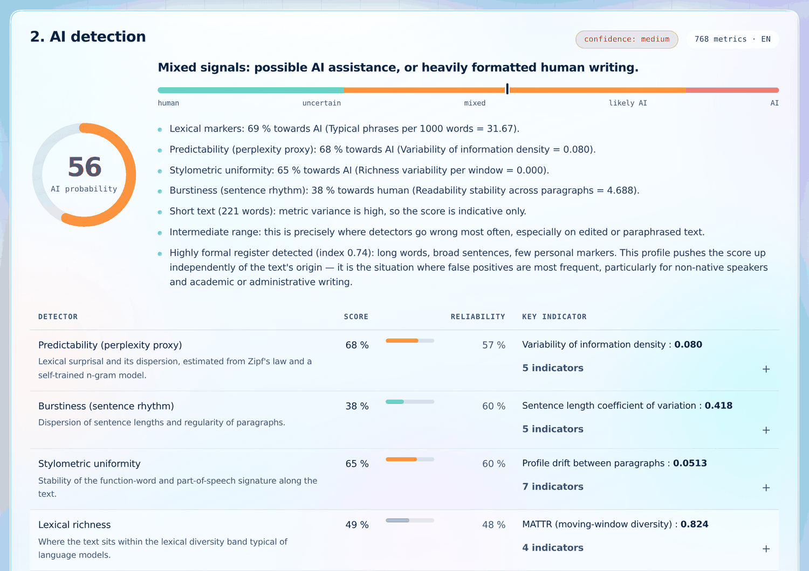
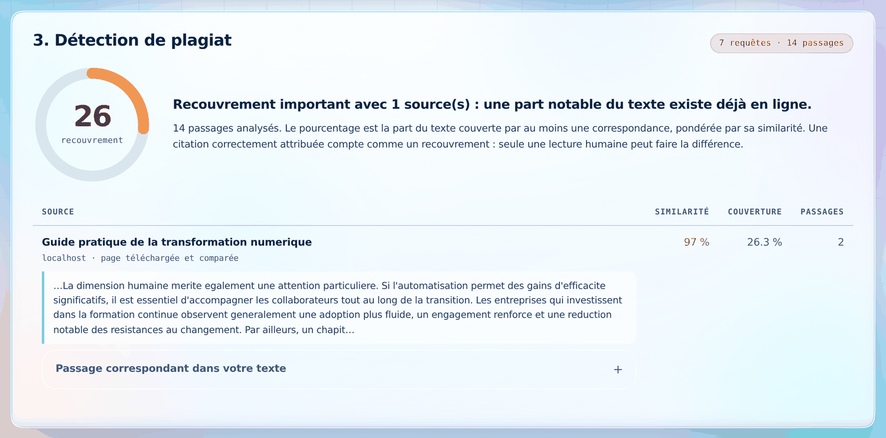
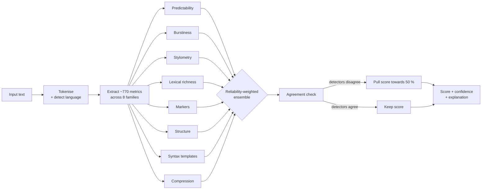
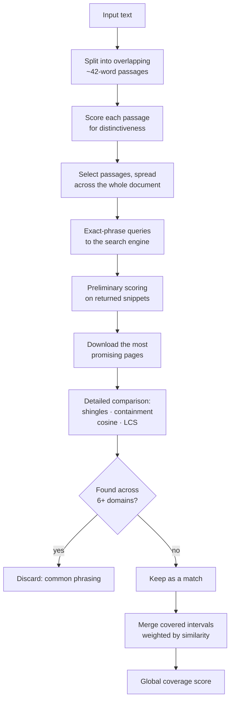
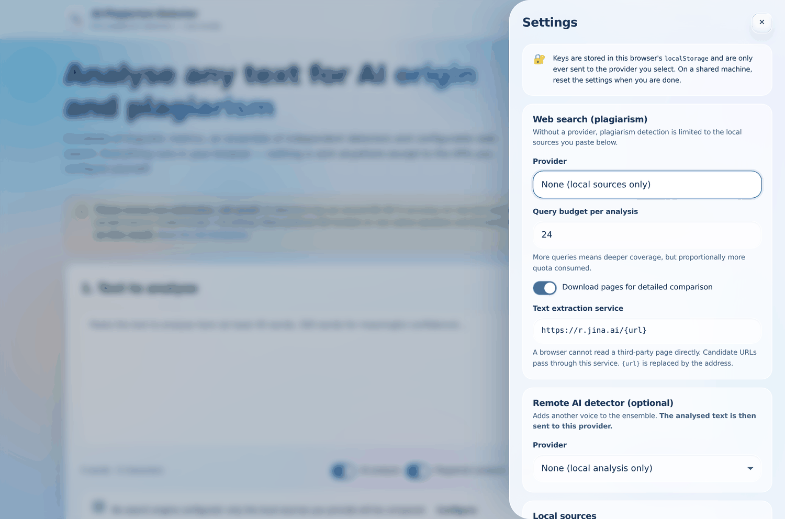
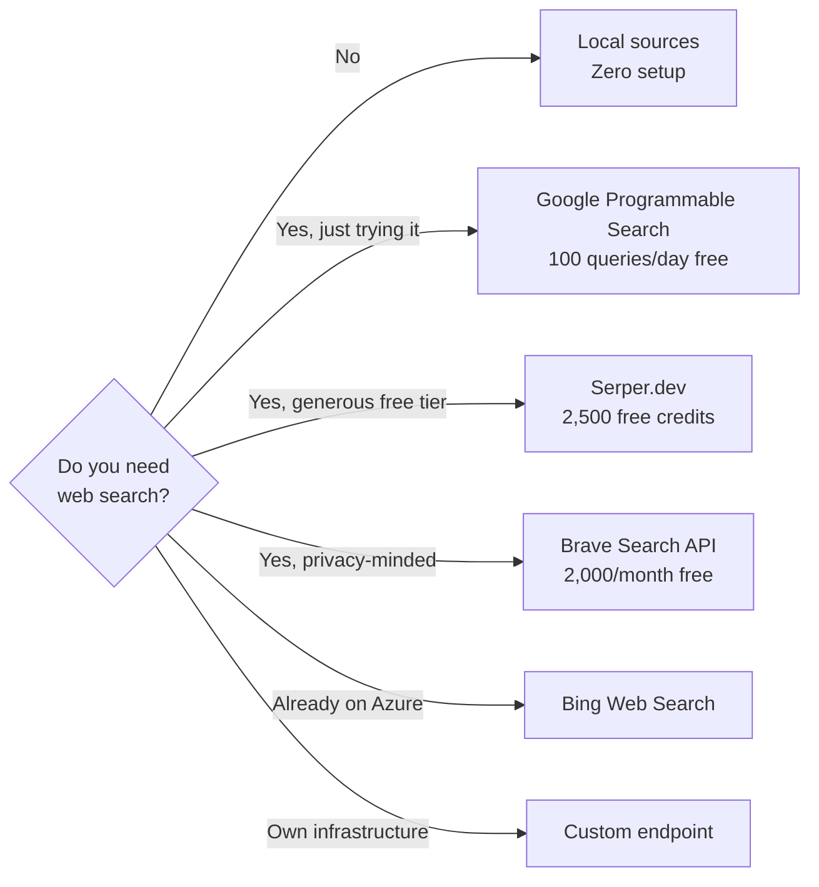
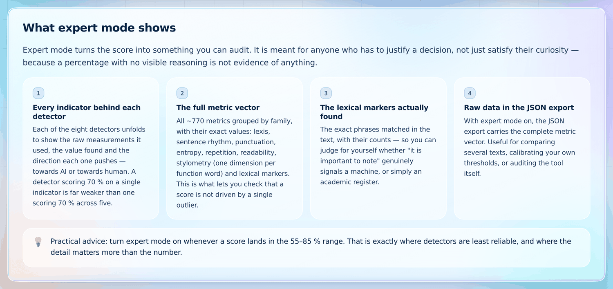
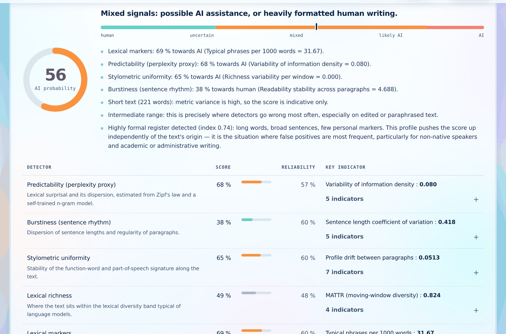
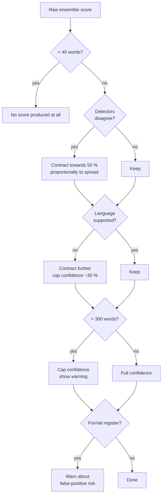

<div align="center">

# 🔍 AI-Plagiarism-Detector

**An AI-text and plagiarism detector that runs entirely in your browser.**

~770 linguistic metrics · 8 independent detectors · configurable web search · zero build step

[](package.json)
[](#-architecture)
[](#-bilingual-interface)
[](tests/run.js)
[](LICENSE)



</div>

> [!WARNING]
> **The scores this tool produces are statistical estimates, not proof.** They carry no legal
> or disciplinary weight. AI detectors top out around 80–90 % accuracy on raw text and degrade
> sharply on edited, paraphrased or mixed human + AI writing — and their false positives fall
> hardest on non-native speakers. Read [`docs/LIMITATIONS.md`](docs/LIMITATIONS.md) before any
> real-world use.

---

## Table of contents

- [Why this exists](#-why-this-exists)
- [Quick start](#-quick-start)
- [What it does](#-what-it-does)
- [How AI detection works](#-how-ai-detection-works)
- [How plagiarism detection works](#-how-plagiarism-detection-works)
- [Setting up the search APIs](#-setting-up-the-search-apis) ← **the part most people need**
- [Setting up a remote AI detector](#-setting-up-a-remote-ai-detector)
- [Expert mode](#-expert-mode)
- [Bilingual interface](#-bilingual-interface)
- [Built-in safeguards](#-built-in-safeguards)
- [Architecture](#-architecture)
- [Extending it](#-extending-it)
- [Privacy](#-privacy)
- [Browser support](#-browser-support)

---

## 💡 Why this exists

Most AI detectors give you a number and nothing else. A number you cannot audit is not evidence —
and people are being failed, disciplined and rejected on the strength of those numbers.

This tool takes the opposite position:

| Typical detector | This one |
|---|---|
| One opaque score | 8 independent detectors, each with its own score and reliability |
| No reasoning shown | Every indicator, its value and its direction, visible in expert mode |
| Confident on 50 words | Refuses to score below 40 words, caps confidence below 300 |
| Silent about disagreement | Disagreement between detectors **pulls the score back towards 50 %** |
| Silent about false positives | Warns explicitly when a formal register is inflating the score |
| Sends your text to a server | Runs locally; nothing leaves the browser unless you configure an API |

---

## 🚀 Quick start

No installation, no dependencies, no build step.

```bash
git clone https://github.com/jamesdoe6/AI-and-Plagiarism-detection.git
cd AI-and-Plagiarism-detection
npm start                 # or: python3 -m http.server 4173
```

Then open **<http://localhost:4173>**.

```bash
npm test                  # 25 regression tests (Node >= 20)
```

> [!NOTE]
> A server is required: the app uses ES modules, which browsers refuse to load over `file://`.
> Any static host works — GitHub Pages, Netlify, Cloudflare Pages, a folder behind nginx.

**AI detection works immediately, with no configuration at all.** Only plagiarism *web* search
needs an API key — and even that has an offline fallback (see [local sources](#option-c--no-api-at-all-offline-mode)).

---

## ✨ What it does

### AI detection — offline, no model download



- **~770 metrics** per analysis across 8 families.
- **8 independent detectors** combined into a reliability-weighted ensemble.
- A score from 0–100 %, a **confidence level**, and a plain-language explanation of what drove it.
- Two optional **remote detectors** (LLM judgement, Hugging Face classifier).

### Plagiarism detection



- Overlapping passage segmentation, distinctiveness-ranked and spread across the whole document.
- Exact-phrase queries against the search engine you configure.
- Candidate pages downloaded and compared in detail.
- A sources table with clickable URL, title, comparable excerpt and similarity score.
- **Offline mode**: compare against reference documents you paste in yourself, no API needed.

### Input and output

| Input | Output |
|---|---|
| `.txt` `.md` `.rtf` `.html` `.csv` `.docx` `.odt` `.pdf` or direct paste | Self-contained HTML report (prints to PDF) |
| 25 MB / 100,000 words max | JSON export of raw data |

DOCX and ODT are parsed **with no library at all** — ZIP central-directory reading plus the native
`DecompressionStream` API. PDFs use pdf.js loaded on demand, with an internal fallback extractor
if the CDN is unreachable.

---

## 🧠 How AI detection works



### The eight detectors

| Detector | What it measures | Weight |
|---|---|:--:|
| **Predictability** | Variability of information density between sentences; lexical surprisal | 1.35 |
| **Burstiness** | Dispersion of sentence lengths, paragraph regularity | 1.25 |
| **Lexical markers** | Phrases and connectives over-represented in LLM output | 1.15 |
| **Stylometric uniformity** | Stability of the function-word signature along the text | 1.00 |
| **Syntactic templates** | Reuse of sentence moulds and function-word sequences | 0.95 |
| **Lexical richness** | Position within the diversity band typical of language models | 0.90 |
| **Redundancy** | Structural compression gain, n-gram reuse (needs ≥ 600 words) | 0.85 |
| **Structure** | Uniform lists, headings, recap conclusion | 0.80 |
| *Remote LLM judgement* | Semantic second opinion (optional) | 1.60 |
| *Remote classifier* | Trained human/AI model (optional) | 1.50 |

The signals are deliberately **orthogonal** — that is what makes the ensemble worth more than the
sum of its parts. Full breakdown in [`docs/METRICS.md`](docs/METRICS.md).

### The calibration story

The first version of this detector was **wrong in principle**, and the fix is worth knowing about.

A scan of all 768 metrics against reference samples showed that most of the "discriminative"
features were actually separating **register** (word length, readability, adjective density) rather
than **origin**. Calibrating on those would have produced a formality detector — which is precisely
the failure mode that flags non-native speakers.

Three concrete corrections followed:

1. **Predictability** was voting "AI" at ~65 % on *everything*, human text included — it confused
   learned vocabulary with rarity. Rebuilt around variability of information density between sentences.
2. **Compression** was voting "human" at ~2 % on everything, having too little material below
   600 words. It now **abstains** instead of adding noise to the ensemble.
3. **Linear ramps** saturated at 0/100 %. They became logistic, so no single metric can cast a
   categorical vote.

Result: **18 points of separation** between generated and human reference texts, and 40.5 % on the
trap case — sober, formal, human technical writing.

---

## 🔎 How plagiarism detection works



**Why four similarity measures instead of one?** No single measure works alone:

- *Jaccard on shingles* catches verbatim copying but misses paraphrase.
- *Weighted cosine* catches paraphrase but over-scores two texts on the same topic.
- *Containment* spots a short extract embedded in a long document.
- *Longest common subsequence over content words* survives insertions and word substitutions.

Measured behaviour on realistic passages:

| Case | Score |
|---|:--:|
| Identical text | 1.00 |
| Passage embedded in a longer page | 0.97 |
| Light paraphrase (2 words changed) | 0.80 |
| Same topic, different text | 0.04 |
| Unrelated | 0.00 |

---

## 🔑 Setting up the search APIs

**This is the only part that needs configuration.** AI detection works with none of it.

Everything is entered in **⚙ Settings** in the app. Keys stay in your browser's `localStorage`
and are only ever sent to the provider you pick.





### Option A — Google Programmable Search *(recommended to start)*

Free tier: **100 queries/day**.

1. Go to <https://programmablesearchengine.google.com/> → **Add**.
2. Give it a name. Under *What to search*, choose **Search the entire web**.
3. Create it, then open **Overview** and copy the **Search engine ID** — this is your `cx`
   (looks like `a1b2c3d4e5f6g7h8i`).
4. Go to <https://console.cloud.google.com/apis/library/customsearch.googleapis.com> and click
   **Enable** on the *Custom Search API*.
5. Go to **APIs & Services → Credentials → Create credentials → API key**. Copy the key.
6. In the app: **⚙ Settings → Web search → Provider = Google Programmable Search**, paste the
   **API key** and the **Engine ID (cx)**, then **Save**.

<details>
<summary>Recommended: restrict the API key</summary>

In the Google Cloud console, open the key → **API restrictions** → *Restrict key* → select only
**Custom Search API**. Because this is a client-side app, the key is visible to anyone using your
deployment — restricting it limits what a leaked key can do. For a public deployment, put the key
behind a [custom endpoint](#option-e--custom-endpoint-your-own-proxy) instead.
</details>

### Option B — Serper.dev

Google results, **2,500 free credits** on sign-up. Simplest setup of the lot.

1. Sign up at <https://serper.dev>.
2. Copy the API key from your dashboard.
3. In the app: **Provider = Serper.dev**, paste the key, **Save**. Nothing else to configure.

### Option C — Brave Search API

Independent index, **2,000 queries/month** free.

1. Sign up at <https://brave.com/search/api/> and pick the *Free* plan.
2. Create a subscription token in the dashboard.
3. In the app: **Provider = Brave Search API**, paste the token, **Save**.

### Option D — Bing Web Search (Azure)

1. In the [Azure portal](https://portal.azure.com), create a **Bing Search v7** resource.
2. Open **Keys and Endpoint**, copy **KEY 1**.
3. In the app: **Provider = Bing Web Search (Azure)**, paste the key, **Save**.

### Option E — Custom endpoint (your own proxy)

Use this to plug in any engine, hide your API key server-side, or work around a provider that
does not allow CORS.

The app calls `GET <your-url>?q=<query>` and expects:

```json
{ "results": [ { "url": "…", "title": "…", "snippet": "…" } ] }
```

A bare array is also accepted, as are the alternate keys `link`, `name` and `description`.
If you fill in the API key field, it is sent as `Authorization: Bearer <key>`.

<details>
<summary>Minimal Cloudflare Worker proxy (keeps your key server-side)</summary>

```js
export default {
  async fetch(request, env) {
    const q = new URL(request.url).searchParams.get('q');
    if (!q) return new Response('[]', { headers: cors() });

    const upstream = await fetch('https://google.serper.dev/search', {
      method: 'POST',
      headers: { 'content-type': 'application/json', 'X-API-KEY': env.SERPER_KEY },
      body: JSON.stringify({ q, num: 10 }),
    });
    const data = await upstream.json();

    return new Response(JSON.stringify({
      results: (data.organic ?? []).map((r) => ({ url: r.link, title: r.title, snippet: r.snippet })),
    }), { headers: cors() });
  },
};

const cors = () => ({
  'content-type': 'application/json',
  'access-control-allow-origin': '*',
});
```

Deploy it, then in the app set **Provider = Custom endpoint** and **Endpoint URL =**
`https://your-worker.workers.dev`.
</details>

### Option F — No API at all (offline mode)

Paste your reference documents into **⚙ Settings → Local sources**, separated by a line
containing `---`:

```text
First reference document…
---
Second reference document…
```

Comparison runs locally with the same similarity measures. Ideal for checking a batch of student
papers against each other, or against a corpus you cannot upload anywhere.

### Query budget

Adjustable from **4 to 120 queries** per analysis (24 by default). Each query consumes your quota.
A higher budget means finer coverage — queried passages are spread across the whole document rather
than concentrated at the start.

### Page content extraction

A browser cannot fetch a third-party page (same-origin policy). Without an extraction service,
comparison is limited to the few lines the search engine returns, which is markedly less reliable.

Default: `https://r.jina.ai/{url}` — returns a page's plain text and allows CORS. `{url}` is
replaced by the candidate address.

> **What this implies:** the URLs found pass through that service. Your text does not. If that is
> not acceptable, untick *Download pages for detailed comparison*, or replace the URL template with
> your own extractor.

### Troubleshooting

| Symptom | Cause |
|---|---|
| `key rejected (HTTP 401/403)` | Invalid key, or the API is not enabled on the provider side |
| `quota exceeded (HTTP 429)` | Quota exhausted — lower the query budget |
| `Could not read <host>` | The extraction service could not read the page (paywall, robots, timeout). The analysis continues on the search snippet |
| `Timed out` | Slow network or provider down. Queries are retried twice with growing backoff |
| CORS error in the console | The provider does not allow browser calls — use a custom endpoint |

The live log during analysis details every incident. **Errors never abort the analysis**: the
plagiarism score is then partial, and the interface flags it explicitly as a lower bound.

---

## 🤖 Setting up a remote AI detector

Optional. Adds another voice to the ensemble.

> [!CAUTION]
> **The analysed text is sent to the provider you choose** (truncated to 12,000 characters).
> This is off by default.

| Provider | Setup |
|---|---|
| **Claude (Anthropic)** | Key from <https://console.anthropic.com>. Default model `claude-sonnet-5`. The browser-access header is sent automatically. |
| **OpenAI-compatible** | Any service exposing `/chat/completions` — OpenAI, or a local model via Ollama / LM Studio / vLLM. Enter the base URL, key and model name. **A local model means nothing leaves your machine.** |
| **Hugging Face** | Plugs in a real trained classifier. Default `openai-community/roberta-base-openai-detector`. Also works with `Hello-SimpleAI/chatgpt-detector-roberta`. |

The classifier splits text into ~1,400-character chunks on sentence boundaries (8 max) and averages
the scores. High dispersion between chunks is reported — it often indicates mixed human + AI text.

> These public models were trained on older generations. They add a voice to the ensemble, not a verdict.

---

## 🔬 Expert mode



Toggle **Expert mode** in the top bar to turn the score into something you can audit. It is meant
for anyone who has to justify a decision — because a percentage with no visible reasoning is not
evidence of anything.



It reveals:

1. **Every indicator behind each detector** — the raw measurements used, the value found, and which
   way each one pushes. A detector scoring 70 % on one indicator is far weaker than one scoring
   70 % across five.
2. **The full metric vector** — all ~770 metrics grouped by family, with exact values. This is what
   lets you check a score is not driven by a single outlier.
3. **The lexical markers actually found** — the exact phrases matched and their counts, so you can
   judge whether "it is important to note" signals a machine or simply an academic register.
4. **Raw data in the JSON export** — with expert mode on, the export carries the complete metric
   vector. Useful for comparing texts, calibrating your own thresholds, or auditing the tool itself.

> **Practical advice:** turn it on whenever a score lands in the 55–85 % range. That is exactly
> where detectors are least reliable, and where the detail matters more than the number.

---

## 🌍 Bilingual interface

English is the default; French is one click away in the top bar (an iOS-style segmented control).

The switch **re-renders existing results without re-running the analysis** — verdicts, detector
labels, indicators, reasons and even the run log are stored as translation keys rather than
strings, and resolved at render time.

Analysis itself supports **English and French** text: function-word lists, marker lexicons,
frequency tables and syllable rules exist for both. Any other language is detected as unsupported,
and the score is contracted towards 50 % with reduced confidence rather than silently reported as
if it meant something.

`npm test` fails if the two dictionaries diverge structurally or if a placeholder is missing in
one language — a missing translation would otherwise surface as an English string mid-sentence.

---

## 🛡️ Built-in safeguards

These are not options. They are hard-coded.



| Safeguard | Behaviour |
|---|---|
| Under 40 words | **No score at all** |
| Under 300 words | Confidence capped, warning displayed |
| Detector disagreement | Score pulled back towards 50 % |
| Unsupported language | Score contracted, confidence reduced |
| Soft ramps | No single metric can vote 0 % or 100 % (extremes are ~6 % and ~94 %) |
| Insufficient material | The detector **abstains** rather than guessing |
| Alert threshold | 85 % by default, never 30 %; adjustable 55–95 % and it moves the whole scale |
| Formality index | Warns explicitly when register, not origin, may be inflating the score |
| Common phrasing | A match found across 6+ domains is discarded, not counted as plagiarism |
| Coverage | Intervals merged and weighted, so a passage found on five sites counts once |

---

## 🏗️ Architecture

```
index.html
assets/css/     base.css (tokens) · glass.css (Liquid Glass material) · components.css
assets/js/
  config.js               thresholds, weights, providers — everything tunable
  i18n/                   en.js · fr.js · runtime (English is the reference)
  core/                   tokenize · stats · language
  data/                   function words · markers · frequency tables
  features/               8 extractors → a ~770-dimension vector
  detectors/              8 local detectors + 2 remote + the ensemble
  plagiarism/             segmenter · similarity · providers · fetcher · engine
  io/                     file-parsers · docx · pdf · report
  ui/                     settings · render · sample
  app.js                  controller
docs/                     METRICS · LIMITATIONS · API-SETUP · images
tests/                    calibration samples + regression suite
```

**Design system.** The interface uses the same *Liquid Glass* material as
[the author's portfolio](https://portofolio-cyber.jamesdoe6.workers.dev/): a luminous light
background the glass has something to refract, white translucent panes with chromatic dispersion at
the rim (cyan top-left, violet bottom-right), specular highlights, iOS spring easing and squircle
corners where the browser supports them.

---

## 🔧 Extending it

| Goal | How |
|---|---|
| **Add a metric** | Drop it into a `features/` module with a consistent prefix. It appears automatically in expert mode and the JSON export. |
| **Make it count** | Consume it in a `detectors/` module — presence in the vector alone changes nothing. |
| **Add a detector** | Export `{ id, labelKey, descriptionKey, run(ctx) }`, register it in `detectors/ensemble.js` and `DETECTOR_WEIGHTS`. |
| **Add a search engine** | Add a function to `plagiarism/providers.js` returning `[{url, title, snippet}]`. |
| **Add a language** | Add a dictionary to `i18n/`, plus word lists in `data/`. `npm test` enforces key parity. |
| **Retune thresholds** | Everything lives in `config.js`. |

---

## 🔒 Privacy

| Operation | What leaves your browser |
|---|---|
| AI analysis | **Nothing** |
| Local source comparison | **Nothing** |
| Web search | 11-word extracts of your text, to the configured engine only |
| Page extraction | Candidate URLs — not your text |
| Remote AI detector | The full text (truncated to 12,000 chars), to the chosen provider. **Off by default.** |

API keys live in this browser's `localStorage` and are transmitted only to the provider you select.

---

## 🌐 Browser support

Chrome/Edge 111+, Firefox 113+, Safari 16.4+.

Requires `CompressionStream`, `DecompressionStream`, `color-mix()` and ES modules.
`backdrop-filter` degrades gracefully where unsupported.

---

## 📄 License

MIT — see [`LICENSE`](LICENSE).

<div align="center">
<sub>Built as a demonstration that a detector can be transparent about its own limits.</sub>
</div>
